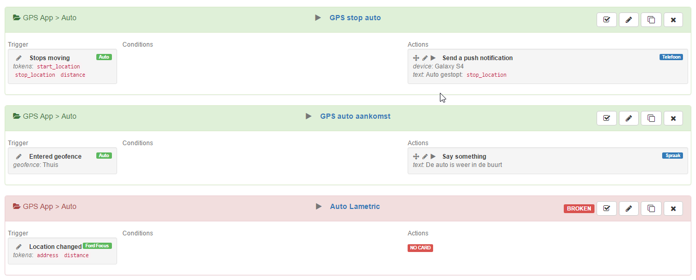

# Realtime Homey Logger and Homey V2 Flow Viewer

Add your local homey ip-address and bearer token in the config.js file and open index.html and flowview.html in a browser.

```
setup = {
  ip: '0.0.0.0',                // Put your ip here or athom cloud uri,
  bearer_token: 'your token',   // Put your V2 bearer token here (i got mine sniffing on app <> homey communications)
  protocol: 'http'              // Change to https if using athom cloud
  homeyId: 'yourhomeyid'        // Put your Homey Cloud ID here (same as athom cloud uri)
}
```

### Discover your bearer_token
This tool does not use the new web API with neat authentication. See [here](getbearer.md) to get your bearer-token.
You could also find your token by sniffing traffic between the Homey app and Homey with a packet capture app on an Android device.

### Flow Viewer (flowview.html)
View, search, organize, copy, re-order and test your Homey flows.


### Realtime Logger (index.html)
Realtime logger is now started to log on Homey V2. 
