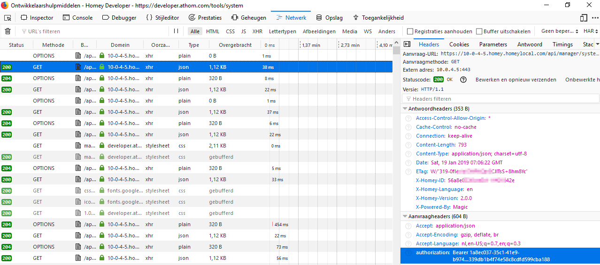

# Getting your bearertoken in Homey

### For Homey 1.x
Go to https://my.athom.com/#/ and log in there
right-click on your Homey and choose copy link
then paste your bearer-token from the link  

### For Homey 2.x
Getting you bearertoken in Homey 2.0 is a little bit more difficult.

Visit https://developer.athom.com/tools/system
Then press F12, go to "Network" and select a GET-request. In the right column you'll find your bearer-token.  

Beware the bearertoken might change more regularly on V2.x (if there's a new login to the dev-pages) so you might have to redo this more often then on Homey 1.x
